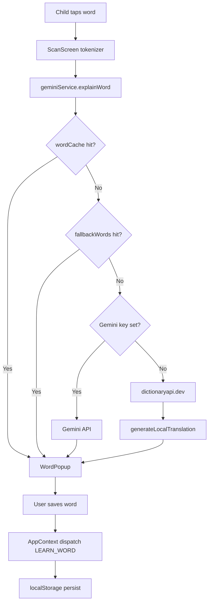

<div align="center">
  <h1>Handog Aral</h1>
  <p><em>"Ang Imo Gabay sa Pagbasa" — AI-powered literacy companion for Filipino children in rural areas and children with dyslexia.</em></p>


  <br/>


</div>

---

## Overview

Handog Aral is a mobile-first literacy app built for Filipino children aged 6–12, with a focus on rural communities and learners with dyslexia. Children tap any word in a scanned book page or story to get an instant, child-friendly definition in either Hiligaynon or Filipino. The app works fully offline for 250+ common words and wraps natively as an Android APK via Capacitor.

- Tap any word in a scanned page or in-app story for an instant definition
- Scan physical book pages with the camera (Gemini Vision or Tesseract.js OCR)
- Hear words pronounced aloud with adjustable Text-to-Speech speed
- Earn stars and track daily streaks to encourage consistent reading
- Test vocabulary knowledge with a multiple-choice quiz
- Full dyslexia support: OpenDyslexic font, adjustable font size, color overlays

---

## Tech Stack

| Technology         | Version        | Category   | Purpose                                              |
| ------------------ | -------------- | ---------- | ---------------------------------------------------- |
| React              | ^19.2.4        | Framework  | UI component layer and screen rendering              |
| Vite               | ^7.0.0         | Build Tool | Dev server, HMR, production bundler                  |
| Tailwind CSS       | ^4.2.2         | Styling    | Utility-first CSS with custom "Isla Sunrise" palette |
| @tailwindcss/vite  | ^4.2.2         | Styling    | Vite-native Tailwind v4 plugin                       |
| Google Gemini API  | ^0.24.1        | AI         | Context-aware word definitions and Vision OCR        |
| Tesseract.js       | ^7.0.0         | OCR        | Client-side offline OCR fallback                     |
| lucide-react       | ^1.7.0         | Icons      | Tree-shaken icon set used across all screens         |
| vite-plugin-pwa    | ^1.2.0         | PWA        | Workbox service worker for offline caching           |
| @capacitor/core    | ^8.3.0         | Mobile     | Android WebView wrapper runtime                      |
| @capacitor/android | ^8.3.0         | Mobile     | Android project integration                          |
| @capacitor/cli     | ^8.3.0         | Mobile     | Capacitor CLI tooling                                |
| autoprefixer       | ^10.4.27       | Styling    | PostCSS vendor prefix automation                     |
| postcss            | ^8.5.8         | Styling    | CSS transformation pipeline                          |
| Web Speech API     | Browser native | Audio      | Text-to-speech utterance, no external library        |
| dictionaryapi.dev  | Free, no key   | Fallback   | English definitions when Gemini is unavailable       |

---

## File & Directory Structure

```
handog-aral/
+-- index.html                  # App HTML shell, PWA meta tags
+-- vite.config.js              # Vite + React + Tailwind + PWA plugin config
+-- eslint.config.js            # ESLint flat config (react-hooks, react-refresh)
+-- capacitor.config.json       # Capacitor app ID, name, and webDir
+-- package.json                # Dependencies and npm scripts
+-- public/                     # Static assets served as-is (icons, manifest)
+-- android/                    # Capacitor-generated Android Studio project
|   +-- app/
|   |   +-- build.gradle        # Android app module build config
|   |   \-- src/main/
|   |       +-- AndroidManifest.xml   # Android permissions (camera, internet)
|   |       \-- assets/public/        # Built dist/ copied here by Capacitor
|   \-- build.gradle            # Root Android Gradle build file
\-- src/
    +-- main.jsx                # ReactDOM.createRoot entry point
    +-- App.jsx                 # String-based screen state machine router
    +-- index.css               # Tailwind directives, custom palette, keyframes
    +-- assets/                 # Images and fonts (OpenDyslexic)
    +-- context/
    |   \-- AppContext.jsx       # Global state: useReducer + localStorage persistence
    +-- components/
    |   +-- BottomNav.jsx        # 5-tab nav bar with floating center Scan FAB
    |   +-- BookCard.jsx         # Book list item: progress bar + level badge
    |   +-- CameraScanner.jsx    # Full-screen camera viewfinder (capture/flip/gallery)
    |   +-- Mascot.jsx           # Animated owl emoji mascot component
    |   +-- StarProgress.jsx     # Star row in normal and compact header mode
    |   \-- WordPopup.jsx        # Bottom-sheet definition card with TTS + save button
    +-- screens/
    |   +-- SplashScreen.jsx     # Animated 2.8 s app intro
    |   +-- HomeScreen.jsx       # Dashboard: greeting, streak, stats, quick actions
    |   +-- ScanScreen.jsx       # Camera / paste reader with tappable word tokens
    |   +-- BooksScreen.jsx      # Story library with per-book completion stats
    |   +-- VocabularyScreen.jsx # Saved words with search + difficulty filter
    |   +-- QuizScreen.jsx       # Multiple-choice quiz with score and high-score badge
    |   \-- SettingsScreen.jsx   # Name, language, font size, a11y, Gemini API key
    +-- data/
    |   +-- books.js             # 6 sample English story entries (title, emoji, color, text)
    |   +-- fallbackWords.js     # 250+ offline definitions with Hiligaynon + Tagalog fields
    |   \-- translations.js      # UI string translations keyed by language setting
    +-- hooks/
    |   +-- useTextToSpeech.js   # Web Speech API speak() wrapper
    |   \-- useTranslations.js   # Returns the correct UI strings for the active language
    \-- services/
        +-- geminiService.js     # Gemini prompts, Dictionary API fallback, key management
        \-- ocrService.js        # Gemini Vision primary + Tesseract.js fallback OCR
```

- **`src/App.jsx`** — Acts as the entire router. A single `screen` string state decides which component renders. No React Router means no URL conflicts inside the Android Capacitor WebView.
- **`src/context/AppContext.jsx`** — Single source of truth for all persistent state. Every dispatch triggers a `localStorage.setItem` write so state survives app restarts and cold opens.
- **`src/services/geminiService.js`** — Handles all AI interactions: word definition prompts with sentence context, Vision OCR, the free Dictionary API fallback, and the `generateLocalTranslation()` POS-aware template engine.
- **`src/data/fallbackWords.js`** — 250+ curated entries guarantee instant, offline definitions for the most common children's-book vocabulary without any network call.

---

## Architecture & How the Code Works Together

Handog Aral follows a **single-context, layered architecture** with no backend server. The entire data flow runs in the browser (or Android WebView):

```
User taps word
     |
     v
ScanScreen (tokenizer + findSentence)
     |
     v
geminiService.explainWord()
     |-- 1. wordCache hit?         --> WordPopup (instant)
     |-- 2. fallbackWords.js hit?  --> WordPopup (offline)
     |-- 3. Gemini API available?  --> Gemini API (gemini-2.0-flash) --> WordPopup
     \-- 4. dictionaryapi.dev      --> generateLocalTranslation() --> WordPopup
```

**State layer:** `AppContext` (React Context + `useReducer`) persists all state to `localStorage` on every change. On cold start, `loadState()` merges saved data with `initialState`. There is no Redux, Zustand, or external state manager.

**Screen layer:** `App.jsx` is a plain string state machine. `BottomNav` calls `onNavigate(screenId)` to switch screens. The pattern avoids React Router entirely, which is critical for the Capacitor Android WebView which does not handle URL-based navigation reliably.

**Service layer:** `geminiService.js` owns all outbound network calls (Gemini REST API and dictionaryapi.dev). `ocrService.js` chains Gemini Vision → Tesseract.js for image-to-text. Both services have no global side effects beyond the `genAI` singleton.

**Build layer:** Vite bundles the app into `dist/`. `vite-plugin-pwa` injects a Workbox service worker that pre-caches all assets on first load. Capacitor copies `dist/` into `android/app/src/main/assets/public/` for the native APK build.



---

## Getting Started

### Prerequisites

- **Node.js** >= 18.x
- **npm** >= 9.x
- **Android Studio** (only required for building the Android APK)

### Installation

1. **Clone the repository**

   ```bash
   git clone https://github.com/your-username/handog-aral.git
   cd handog-aral
   ```

2. **Install dependencies** using npm (lockfile detected: `package-lock.json`)
   ```bash
   npm install
   ```

### Environment Variables

The Gemini API key is optional. The app works fully offline using `fallbackWords.js` and the free `dictionaryapi.dev` when no key is set.

Create a `.env` file in the project root:

```env
VITE_GEMINI_API_KEY=your_gemini_api_key_here
```

| Variable              | Description                                                  | Required | Where to Obtain                                                                                |
| --------------------- | ------------------------------------------------------------ | -------- | ---------------------------------------------------------------------------------------------- |
| `VITE_GEMINI_API_KEY` | Google Gemini API key for AI word definitions and Vision OCR | No       | [aistudio.google.com/app/apikey](https://aistudio.google.com/app/apikey) — free tier available |

Alternatively, enter the key at runtime via the app's **Settings** screen. It is stored in `localStorage` under `handog-gemini-key`.

### Running the Project

**Development** — hot-reload dev server:

```bash
npm run dev
```

Open [http://localhost:5173](http://localhost:5173) in your browser.

**Production Build** — compiles and bundles to `dist/`:

```bash
npm run build
```

**Production Preview** — serves the production build locally:

```bash
npm run preview
```

**Android APK** — sync the Vite build into the Capacitor Android project, then open in Android Studio:

```bash
npm run build
npx cap sync android
npx cap open android
```

---

## Available Scripts

| Script    | Command        | Description                                                 |
| --------- | -------------- | ----------------------------------------------------------- |
| `dev`     | `vite`         | Start Vite dev server with HMR at localhost:5173            |
| `build`   | `vite build`   | Production bundle output to `dist/` with PWA service worker |
| `preview` | `vite preview` | Serve the production `dist/` build locally                  |
| `lint`    | `eslint .`     | Run ESLint across all source files                          |

---

## Contributing

1. Fork the repository and create a new branch: `git checkout -b feat/your-feature-name`
2. Make your changes and ensure the app runs without errors: `npm run dev`
3. Lint your code: `npm run lint`
4. Commit with a descriptive message: `git commit -m "feat: describe your change"`
5. Push your branch: `git push origin feat/your-feature-name`
6. Open a Pull Request against `main`

---

## License

No license file detected. All rights reserved.

- **Tap any word** — Get instant child-friendly explanations in Hiligaynon or Filipino
- **Camera OCR** — Scan physical books using your phone camera (Tesseract.js)
- **Text-to-Speech** — Hear words pronounced aloud at adjustable speeds
- **Fallback dictionary** — 250+ pre-loaded word definitions work fully offline

### Accessibility

- **Dyslexia support** — OpenDyslexic font toggle with increased word/letter spacing
- **Adjustable font size** — Small, Medium, Large
- **Color overlays** — Yellow, Blue, or Pink reading tint to reduce visual stress

### Gamification & Progress

- **Star system** — Earn ⭐ stars as you learn more words (1 star per 3 words, max 5)
- **Daily streak tracker** — Tracks consecutive days of app use with a 🔥 badge
- **Vocabulary collection** — All tapped & saved words stored persistently
- **Vocabulary Quiz** — Multiple-choice quiz built from your saved words with high-score tracking

### Library

- **Books screen** — Browse sample stories with per-book progress tracking (% read)
- **Book levels** — Visual progress badges: Bag-o / Ginapadayon / Malapit na! / Natapos!

### AI & Personalization

- **Google Gemini API** — Context-aware definitions using the sentence around the tapped word
- **Language toggle** — Switch explanations between Hiligaynon and Filipino/Tagalog
- **Child name** — Personalized greetings and mascot messages
- **Offline-capable** — PWA with service worker caching

---

## What's New (v2.4)

### All-English Book Library

- **6 fully English books** — All stories were rewritten or replaced to support English literacy. Previously 2 of 3 books used Tagalog text. New titles: _The Brave Little Fox_, _Maria and the Shining Star_, _Pedro and the Rice Field_, _The Rainbow After the Rain_, _The Slow and Steady Turtle_, _A Day at the Market_.
- **Vocabulary aligned to offline dictionary** — Every story was rewritten so key "tap-worthy" words (`enormous`, `wilderness`, `whispered`, `determined`, `patient`, `peculiar`, `rainbow`, `magnificent`, `protect`, `careful`, etc.) exist as keys in `fallbackWords.js`. Children get instant offline definitions for the most important words in each story without needing Gemini or a network connection.

### Language-Aware Definitions

- **Dual translation fields in `fallbackWords.js`** — Every entry now has separate `hiligaynon:` and `tagalog:` fields instead of a single `translation:` field. `geminiService.js` picks the correct field based on `targetLanguage`.
- **Last-resort placeholders are language-specific** — Even the final fallback text in `explainWord()` now returns the correct language instead of always showing a Hiligaynon string.

### Home Screen Book Count

- **Book count is now dynamic** — The home screen card previously displayed a hardcoded `"3 na libro"` / `"3 ka libro"`. It now reads `sampleBooks.length` at runtime, so adding or removing books from `books.js` is automatically reflected.

---

## What's New (v2.1)

- **Vocabulary Quiz** (`QuizScreen`) — Test knowledge of saved words with 4-choice questions, per-question feedback, score recap, and high-score badge. Unlocks after saving 4+ words.
- **Daily streak** — Opens the app daily to maintain a streak shown on the home screen
- **Redesigned navigation** — 5-tab bottom nav with a floating center Scan FAB button
- **Redesigned Home screen** — Stats row (words · streak · stars), time-aware greeting, and adaptive encouragement cards
- **Redesigned Books screen** — Gradient header with completion stats; BookCard redesigned with color accent bar and level badge
- **Vocabulary filtering & search** — Filter words by difficulty; search by word or translation
- **Improved WordPopup** — Rounded emoji cover tile, inline phonetic + difficulty badge, backdrop blur, and example sentence support
- **Star progress compact mode** — Stars display inline in the header stats row

---

## What's Changed (v2.3)

### Word Definition Fixes

- **All words now have a real Hiligaynon translation** — Previously, any word not in the built-in fallback list would show `"I-set ang Gemini API key para sa paliwanag sa Hiligaynon."` in the translation field instead of an actual definition. This happened because `lookupDictionaryAPI()` fetched a correct English definition from `dictionaryapi.dev` but then hardcoded the API-key nudge into the `translation` field.
- **New `generateLocalTranslation()` helper** — A pure-local function in `geminiService.js` that produces a readable Hiligaynon (or Filipino) sentence from the dictionary API result, using POS-aware templates: verbs show `Buhat — "word" nagakahulugan: …`, nouns show `"word" — isa ka butang ukon tawo: …`, adjectives show `Nagahulagway — …`, with a universal fallback. Works for both language settings.
- **Expanded `fallbackWords.js` from ~90 to ~250 entries** — Added ~160 high-frequency children's-book words with curated Hiligaynon translations. New coverage includes: common verbs (`covered`, `walked`, `found`, `gave`, `felt`, `heard`, `became`, `called`, `helped`, `opened`, `tried`, `jumped`, `stopped`…), adjectives (`lonely`, `angry`, `tired`, `hungry`, `sick`, `lost`, `fast`, `slow`, `clean`, `wet`, `dry`, `sweet`, `sour`…), nouns (`morning`, `tree`, `rain`, `fire`, `dog`, `bird`, `fish`, `rice`, `rice`, `voice`, `gift`…), and function/grammar words (`always`, `never`, `around`, `through`, `inside`, `outside`, `until`, `while`…). These are served instantly with no network needed.

---

## What's Changed (v2.2)

### Bug Fixes

- **Font size now scales all screens** — Font size classes are applied to the `<html>` element (not `body`) so Tailwind's `rem`-based text utilities correctly scale across every screen. CSS selectors updated from `body.font-*` to `html.font-*`.
- **Language setting now changes word definitions** — Word cache keys are now language-specific (`word_language`, e.g. `happy_tagalog`). Previously, switching from Filipino to Hiligaynon would still show the cached Filipino definition.
- **All tapped words now get real definitions** — Added a free Dictionary API fallback ([dictionaryapi.dev](https://api.dictionaryapi.dev)) that covers 100,000+ English words. Words not in the built-in fallback list or without a Gemini key now get a proper English definition, phonetics, and example sentence instead of a generic placeholder.

### UI Improvements

- **Bottom nav height is now stable** — Nav tab padding changed to fixed pixels so the bar doesn't grow/shrink when font size changes. Added `--nav-h` CSS variable and `.pb-nav` utility class to replace `pb-24` on all screen wrappers — bottom clearance now always matches the actual nav height.
- **Home screen whitespace fixed** — Removed a broken double-nested div whose inline gradient used invalid Tailwind syntax (`#56C596/15`). Replaced with a clean single card with a border.
- **Home screen: Recently Learned panel** — New 2×2 grid showing the last 4 saved words with emoji and definition. Fills the dead whitespace and gives quick access to vocabulary. Only shown after at least one word is learned.
- **Home screen: inline Quiz shortcut** — "Quiz! 🧠" button appears directly on the encouragement card when the user has 4+ words.

### Settings Screen — API Key Input

- **Reactive key status** — Status text now instantly updates without a page refresh after saving or removing a key.
- **Show/hide toggle** — Eye icon lets you verify what you pasted before saving.
- **Remove key button** — When a key is already set, the input is replaced with a "Remove API Key" button. Clears `localStorage` and resets the Gemini client.
- **Enter key support** — Press Enter to save the key.
- **Disabled state** — Save button is greyed out when the input is empty.

### Colour Palette — Isla Sunrise (Option A)

All colours replaced across the entire codebase (`index.css`, all screens, components, and `data/books.js`):

| Token                   | Before                | After     |
| ----------------------- | --------------------- | --------- |
| `teal`                  | `#2EC4B6`             | `#0EA5A0` |
| `deep-teal`             | `#1A3C40`             | `#0D3D56` |
| `sun-yellow`            | `#FFD166`             | `#F59E0B` |
| `coral`                 | `#FF6B6B`             | `#F4614A` |
| `leaf-green`            | `#56C596`             | `#34D399` |
| `sky-blue` & `lavender` | `#73C2FB` / `#A29BFE` | `#38BDF8` |
| `soft-orange`           | `#FF9F43`             | `#F97316` |
| `cream`                 | `#FFFBF0`             | `#FAFAF7` |
| `dark-text`             | `#2D3436`             | `#1E293B` |
| `muted-text`            | `#636E72`             | `#64748B` |

---

## Setup

### 1. Get a free Gemini API Key

1. Go to [https://aistudio.google.com/app/apikey](https://aistudio.google.com/app/apikey)
2. Click **"Create API Key"**
3. Copy the key

### 2. Configure the API Key

Create a `.env` file in the project root:

```
VITE_GEMINI_API_KEY=your_api_key_here
```

Or enter it in the app's **Settings** screen at runtime.

### 3. Install & Run

```bash
npm install
npm run dev
```

Open [http://localhost:5173](http://localhost:5173) in your browser.

---

## Build for Production

```bash
npm run build
```

Built files are output to `dist/`. The PWA service worker pre-caches all assets for offline use.

---

## Deploy to Vercel (Free)

1. Push your code to GitHub
2. Go to [vercel.com](https://vercel.com) and import your repository
3. Add `VITE_GEMINI_API_KEY` as an environment variable in Vercel project settings
4. Click Deploy

---

## Tech Stack

| Layer                       | Technology                                | Version            |
| --------------------------- | ----------------------------------------- | ------------------ |
| UI Framework                | React + Vite                              | 19 / 7             |
| Styling                     | Tailwind CSS                              | v4                 |
| AI Definitions & Vision OCR | Google Gemini API                         | `gemini-2.0-flash` |
| Offline OCR Fallback        | Tesseract.js                              | v7                 |
| Text-to-Speech              | Web Speech API                            | Browser native     |
| PWA / Offline               | vite-plugin-pwa (Workbox)                 | 1.2.0              |
| Icons                       | lucide-react                              | 1.7.0              |
| State Management            | React Context + useReducer + localStorage | Built-in           |
| Mobile Wrapper              | Capacitor (Android)                       | v8                 |

---

### React 19 + Vite 7

React is the UI layer. The app uses a simple **string-based screen state machine** in `App.jsx` instead of React Router — this keeps the bundle smaller and avoids URL routing complexity that could break the Android Capacitor wrapper. All global state lives in a single `AppContext` backed by `useReducer`. `BookCard` and `WordPopup` are wrapped in `memo()` for targeted re-render prevention. Vite handles the build with its built-in Tailwind v4 plugin and HMR for fast development iteration. Tesseract.js is **dynamically imported** on demand (`import('tesseract.js')`) so the ~2 MB OCR library never blocks the initial page load.

### Tailwind CSS v4

All UI styling uses Tailwind utility classes with a custom **"Isla Sunrise"** design palette defined in `index.css` (teal, deep-teal, sun-yellow, coral, leaf-green, sky-blue, soft-orange, cream). Screens use `max-w-[390px] mx-auto` for a consistent mobile phone width. Font scaling is applied to the `<html>` element as a class (`font-small`, `font-medium`, `font-large`) so every `rem`-based Tailwind utility scales proportionally across the entire app. A `--nav-h` CSS variable tracks the bottom nav's pixel height, and a `.pb-nav` utility class is applied to all screen wrappers so content always clears the nav bar regardless of font size. Entrance animations (`animate-slideUp`, `animate-fadeUp`, `animate-floatOwl`, `animate-scanLine`) are defined as custom `@keyframes` in `index.css`.

### Google Gemini API (`gemini-2.0-flash`)

Used for two tasks:

1. **Word definitions** — When a child taps a word, `geminiService.js` builds a prompt that includes the tapped word, the **full surrounding sentence** (extracted by `findSentence()`), and the user's language preference (Hiligaynon or Filipino). Gemini returns a JSON object with `{ word, phonetic, english, translation, emoji, difficulty, example }`. This context-awareness means "cover" as a verb ("She covered the pot") gets a different definition than "cover" as a noun.

2. **Vision OCR** — When a child scans a page with the camera, `ocrService.js` tries Gemini Vision first via `extractTextFromImageWithGemini()`. Gemini is significantly more accurate than Tesseract for printed book pages and handles varied lighting, fonts, and layouts. The OCR result is the raw text string that becomes the tappable word view.

The API key is optional — the app works fully without it using free fallbacks (see below).

### Tesseract.js v7 (OCR Fallback)

If Gemini Vision fails (no API key, network error, or quota limit), `ocrService.js` falls back to **client-side OCR with Tesseract.js**. The library is dynamically imported to keep it out of the initial bundle. It runs entirely in the browser — no server needed. An `onProgress` callback streams recognition progress (0–100%) back to `ScanScreen` so the animated progress bar stays accurate. Tesseract is slower (10–60 seconds depending on image complexity) but ensures OCR always works offline.

### Web Speech API

Text-to-speech is handled by the browser's native `SpeechSynthesisUtterance` API, wrapped in `useTextToSpeech.js`. No external library is needed. The `speak(text, rate)` function creates an utterance with `lang: "en-US"` and applies the TTS speed stored in app state (0.5×, 0.8×, or 1.2×). This works natively in all modern browsers and in the Android WebView used by the Capacitor build. Words can be spoken individually from the definition popup or the entire scanned text can be read aloud from the scan screen.

### vite-plugin-pwa (Workbox)

Configured in `generateSW` mode. On first load, Workbox pre-caches all built assets (JS, CSS, fonts, icons). A `CacheFirst` runtime strategy handles Google Fonts. After the first visit the entire app shell loads offline. Word definitions also work offline if they hit `fallbackWords.js` or the `wordCache` stored in `localStorage`. The PWA manifest provides the app name, "Isla Sunrise" theme color, and icon references for Android home-screen installation.

### lucide-react

Provides a consistent icon set used across all screens, nav tabs, and action buttons (`Camera`, `BookOpen`, `Brain`, `Star`, `Volume2`, `StopCircle`, `Check`, `Trash2`, etc.). Tree-shaken per icon import, so only referenced icons appear in the final bundle.

### React Context + localStorage (State Management)

There is no Redux or Zustand. All application state — words learned, streaks, quiz scores, settings, book progress, word definition cache — lives in a single `AppContext` with `useReducer`. Every state change triggers a `localStorage.setItem` write. On cold start, `loadState()` reads from `localStorage` and merges with `initialState` (guarding against corrupt data). This gives full persistent state across app restarts with zero external dependencies. The word definition cache (`wordCache`) is included in this persistence layer so tapping a previously-seen word is always instant, even after closing and reopening the app.

### Capacitor v8 (Android)

Capacitor wraps the Vite PWA build as a native Android APK. The `dist/` output is copied into `android/app/src/main/assets/public/`. The app runs inside an Android WebView, which supports the Web Speech API, `getUserMedia` for camera access, and all modern CSS features used by Tailwind. Because the screen router is string-based (not URL-based), there are no routing conflicts with the WebView's navigation model.

---

## File Structure

```
handog-aral/
├── index.html
├── vite.config.js
├── eslint.config.js
├── package.json
│
└── src/
    ├── main.jsx              # App entry point
    ├── App.jsx               # Root router (screen state machine)
    ├── index.css             # Global styles, Tailwind theme, animations
    │
    ├── assets/               # Static assets (images, fonts)
    │
    ├── context/
    │   └── AppContext.jsx    # Global state (words, progress, settings, streak, quiz score)
    │
    ├── components/
    │   ├── BottomNav.jsx     # 5-tab bottom navigation with floating Scan FAB
    │   ├── BookCard.jsx      # Book list item with progress bar and level badge
    │   ├── CameraScanner.jsx # Full-screen camera viewfinder with capture/flip/gallery
    │   ├── Mascot.jsx        # Animated owl emoji mascot
    │   ├── StarProgress.jsx  # Star row (normal + compact mode)
    │   └── WordPopup.jsx     # Bottom-sheet word definition card with TTS + save
    │
    ├── screens/
    │   ├── SplashScreen.jsx  # Animated app intro (2.8s)
    │   ├── HomeScreen.jsx    # Dashboard: greeting, streak, stats, quick actions
    │   ├── ScanScreen.jsx    # Camera / text-paste reader with word tap
    │   ├── BooksScreen.jsx   # Book library with completion stats
    │   ├── VocabularyScreen.jsx  # Saved words with search + difficulty filter
    │   ├── QuizScreen.jsx    # Multiple-choice vocabulary quiz with scoring
    │   └── SettingsScreen.jsx    # Name, language, font, accessibility, API key
    │
    ├── data/
    │   ├── books.js          # Sample book entries (title, emoji, color, text)
    │   ├── fallbackWords.js  # 250+ offline word definitions with curated Hiligaynon translations
    │   └── sightWords.js     # High-frequency words excluded from complex-word detection
    │
    ├── hooks/
    │   ├── useLocalStorage.js   # Generic localStorage read/write hook
    │   └── useTextToSpeech.js   # Web Speech API speak() wrapper
    │
    └── services/
        ├── geminiService.js  # Gemini API prompt, response parsing, Dictionary API fallback, clearApiKey
        └── ocrService.js     # Tesseract.js image-to-text with progress callback
```

---

## Architecture & How It All Works Together

### State Management

All application state lives in a single React Context (`AppContext.jsx`). There is no external state library — it uses `useReducer` with a plain object state and a `localStorage` persistence layer that saves and rehydrates on every mount.

```
AppContext state shape
├── childName          — personalisation (greetings, mascot messages)
├── language           — "hiligaynon" | "tagalog" (drives AI prompt + templates)
├── fontSize           — "small" | "medium" | "large" (applied to <html> as a class)
├── dyslexiaFont       — boolean (applies OpenDyslexic font + spacing via body class)
├── ttsSpeed           — 0.5 | 0.8 | 1.2 (passed to Web Speech API utterance rate)
├── colorOverlay       — "none" | "yellow" | "blue" | "pink" (CSS class on scan viewport)
├── stars              — 0–5 (auto-calculated: floor(wordsLearned.length / 3))
├── wordsLearned       — array of word objects saved by the user
├── wordCache          — keyed by "word_language", avoids duplicate Gemini calls
├── bookProgress       — keyed by book ID, stores % completion (0–100)
├── streak             — day-count of consecutive app opens
├── lastActiveDate     — ISO date string for streak calculation
└── quizHighScore      — persisted across sessions
```

Every screen and component receives data via `useApp()` and dispatches typed actions (`SET_NAME`, `LEARN_WORD`, `CACHE_WORD`, `UPDATE_STREAK`, etc.).

---

### Screen Navigation

`App.jsx` is a simple state-machine router — there is no React Router. A `screen` string state controls which component is rendered. The `BottomNav` component calls `onNavigate(screenId)` to switch screens. This keeps the bundle small and avoids URL-based routing complexity (important for the Android Capacitor wrapper).

```
"splash" → "home" (auto after 2.8s)
"home" ↔ "scan", "books", "vocabulary", "quiz", "settings"  (via BottomNav or buttons)
```

---

### Word Definition Pipeline

This is the core feature loop. When a child taps a word in `ScanScreen`:

```
Tap word
  │
  ├─ 1. Check wordCache (keyed by "word_language")
  │       Hit → show WordPopup immediately
  │
  ├─ 2. Check fallbackWords.js (~250 curated entries)
  │       Hit → show WordPopup, zero network
  │
  ├─ 3. Is Gemini API key available?
  │    ├─ YES → call Gemini API (gemini-2.0-flash)
  │    │         Prompt includes: word, full sentence context, target language
  │    │         Returns: { word, phonetic, english, translation, emoji, difficulty, example }
  │    │         On Gemini failure → fall through to step 4
  │    │
  │    └─ NO → call dictionaryapi.dev (free, no key)
  │              Gets: English definition, phonetic, part-of-speech, example
  │              generateLocalTranslation() converts English def → Hiligaynon/Filipino
  │              using POS-aware templates (verb/noun/adjective/adverb/fallback)
  │
  └─ 4. Total fallback (all above failed)
          Returns a safe generic placeholder
```

The result is cached in `wordCache` under the key `"word_language"` (e.g. `"covered_hiligaynon"`) so switching language and re-tapping a word fetches a fresh definition in the new language.

---

### OCR Flow (Camera → Text)

`CameraScanner.jsx` accesses `getUserMedia` for live preview and provides capture, flip, and gallery-pick controls. The captured image `File` is passed to `ocrService.js`, which dynamically imports `tesseract.js` (code-split to keep initial bundle small), spins up a worker for English recognition, and streams progress events back to the UI via an `onProgress` callback. The extracted text string is placed into `ScanScreen`'s local state as `rawText`.

---

### Tokenizer & Word Tap

`ScanScreen` tokenizes the raw text with a simple regex split on whitespace and punctuation:

```js
text.split(/(\s+|[.,!?;:"""''()\[\]])/).filter(Boolean);
```

Each token is rendered as an inline `<span>`. Word tokens (letters only) are tappable — tap fires `handleWordTap(word, tokens, index)`. Before calling the definition pipeline, a `findSentence()` helper reconstructs the surrounding sentence from the token array (scanning left for a sentence-start, right for sentence-end punctuation). This sentence is passed as context to Gemini so it understands the word's meaning in context ("cover" as a verb vs. "cover" as a noun).

A 300 ms debounce prevents duplicate calls from rapid taps.

---

### Text-to-Speech

`useTextToSpeech.js` wraps the browser's `SpeechSynthesisUtterance` API. The `speak(word, rate)` function creates a new utterance on each call, sets `lang: "en-US"`, applies the `ttsSpeed` from app state, and calls `window.speechSynthesis.speak()`. This works natively in all modern browsers and on Android WebView (used in the Capacitor build) without any additional library.

---

### PWA & Offline

`vite-plugin-pwa` generates a service worker in `generateSW` mode (Workbox). On first load all built assets are pre-cached. A `CacheFirst` runtime cache handles Google Fonts. The app shell (HTML + JS + CSS) loads completely offline after the first visit. Word definitions require network unless they resolve from `fallbackWords.js` or `wordCache` (which is persisted in `localStorage`).

---

### Accessibility Layer

| Setting       | Implementation                                                                                                                                                                                                                                                                             |
| ------------- | ------------------------------------------------------------------------------------------------------------------------------------------------------------------------------------------------------------------------------------------------------------------------------------------ |
| Font size     | Class added to `<html>` (`html.font-small/medium/large`), overrides `font-size` on `:root`. All Tailwind `text-*` and spacing uses `rem` so the whole UI scales proportionally. A `--nav-h` CSS variable tracks the nav height per font size so `.pb-nav` always clears the bar correctly. |
| Dyslexia font | Class added to `<body>` (`body.dyslexia-font`). Applies `font-family: OpenDyslexic` + `word-spacing: 0.3em` + `letter-spacing: 0.05em` globally.                                                                                                                                           |
| Color overlay | A CSS class (`overlay-yellow/blue/pink`) applied to the scan viewport `<div>` using a semi-transparent background color, independent of text color.                                                                                                                                        |
| TTS speed     | Stored in state as a numeric rate (0.5 / 0.8 / 1.2) and passed to `SpeechSynthesisUtterance.rate`.                                                                                                                                                                                         |

---

The app is designed for Filipino children aged **6–12**. All child-facing text is in **Hiligaynon** or **Filipino/Tagalog**. Settings labels are in English for parent/teacher use.

The **Settings screen** lets you:

- Set the child's name for personalized greetings
- Toggle between Hiligaynon and Filipino explanations
- Adjust font size (Small / Medium / Large)
- Enable the OpenDyslexic font
- Set TTS playback speed (Hinay / Normal / Dasig)
- Apply a reading color overlay
- Enter, verify (show/hide), or remove the Gemini API key
- Reset all progress

---

Built with ❤️ for Filipino children
